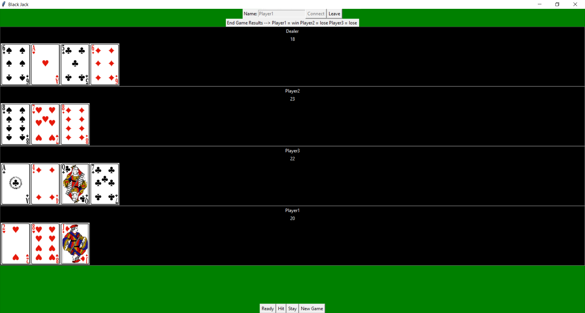

# Blackjack Multiplayer Socket Programming
This program is a Blackjack card game that compatible with multiplayer using socket programming.  
Using server as a dealer and user will be the player.

## Installation
* Users need to install python programming language into the computer before start using
* Starting by opening server.py and press start to start the server
* Using clients.py as a player, every player need to open client.py. Naming username on top of the screen and press join to join the server. The name of user who join the server will appear on Server screen.
* When all player joined the server. To start the game everyone need to be ready by pressing "ready button" on bottom of the screen of thier clients.py screen
* When all player pressed ready, the game will start by dealing the cards to every player, all player will se their cards and dealer card on thier own screen
* After this will follow the rules of Blackjack by pressing "Hit" to draw more cards, "Stay" to stay
* When the game is ended, the winner will be announced on the top of the screen.
* Everyone can start new game by pressing "New Game" button on the screen, this will work like ready button. When everyone pressed new game the game will start again and everyone can play again.
* When someone wants to leave after the game, they can do it by pressing leave button or closing clients.py screen

## Interface
### Server  

### Client

### Results

## Developer
* Raned Chuphueak
* Weeraphat Leelawittayanon

# Thai ReadME.md
โปรแกรมนี้คือโปรแกรมสำหรับการเล่น Blackjack รองรับการเล่นแบบ multiplayer  
โดยมีการ implement มาจากโปรแกรม chat โดยการใช้ socket programming เพื่อใช้ในวิชา CN311 ระบบปฏิบัติการ

## วิธีการใช้งาน
* ผู้ใช้งานจำเป็นต้องทำการติดตั้งภาษา python ภายในคอมพิวเตอร์ก่อนที่จะทำการใช้งาน
* ทำการเปิด server.py ขึ้นมา และทำการกดปุ่ม start เพื่อทำการเปิด server
* ผู้เล่นทำการเปิด clients.py ตามจำนวนผู้เล่นที่ต้องการ ทำการตั้งชื่อ username เพื่อทำการกด join เข้าไปใน server หลังจากที่ผู้เล่นทำการ join เข้าไปแล้ว จะมีชื่อ username ปรากฎขึ้นบนฝั่งหน้าจอ server
* เมื่อผู้เล่นทำการเชื่อมต่อเข้า server ครบทุกคนแล้ว ให้ผู้เล่นทั้งหมดทำการกดปุ่ม "ready" ทางด้านล่างของหน้าจอ เพื่อเป็นการเตรียมพร้อม
* เมื่อผู้เล่นได้ทำการ ready ครบทุกคนแล้ว เกมก็จะเริ่มขึ้นโดยอัตโนมัติ โดยภายในเกมจะมีกติกาตามกฎของเกมไพ่ Blackjack ทั่วไป โดยผู้เล่นสามารถกดปุ่ม "Hit" เพื่อทำการจั่วไพ่เพิ่ม "Stay" เพื่อทำการ stay
* เมื่อผู้เล่นทั้งหมดได้ทำการ stand ครบทุกคน หรือมีไพ่เกิน 21 แต้มแล้ว ระบบจะทำการตรวจสอบและประกาศรายชื่อผู้ชนะออกมาโดยอัตโนมัติ
* หากผู้เล่นทุกคนต้องการเริ่มเกมอีกครั้ง ให้ทำการกดปุ่ม "New Game" ทางด้านล่างของหน้าจอ โดยจะทำงานคล้ายกับการ ready หากผู้เล่นกด new game ครบทุกคนแล้ว เกมก็จะเริ่มขึ้นใหม่โดยอัตโนมัติ
* หากผู้เล่นต้องการที่จะออกจากเกม ให้ทำการกดปุ่ม leave ทางด้านบน หรือทำการปิดตัวโปรแกรม clients.py

## จัดทำโดย
* นาย วีรภัทร ลีลาวิทยานนท์ 6210612823
* นาย รเณศ ชูเผือก 6210612864
