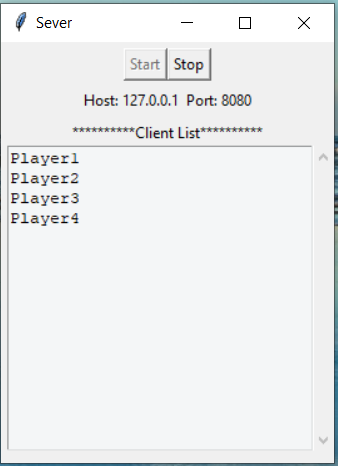

# Blackjack Multiplayer Socket Programming
This program is a Blackjack card game that compatible with multiplayer
by using socket programming. Using server as a dealer and
players will be the player.

## Installation
* User need to install python programming language into the computer before start using
* Starting by opening server.py and press start to start the server
* Using clients.py as a player, every player need to open client.py. Naming username on top of the screen and press join to join the server
* When all player joined the server. To start the game everyone need to be ready by pressing "ready button" on bottom of the screen of thier clients.py screen
* When all player pressed ready, the game will start by dealing the cards to every player, all player will se their cards and dealer card on thier own screen
* After this will follow the rules of Blackjack by pressing "Stand" to stand, "Hit" to draw more cards, "Stay" to stay
* When the game is ended, the winner will be announced on the top of the screen.
* Everyone can start new game by pressing "New Game" button on the screen, this will work like ready button. When everyone pressed new game the game will start again and everyone can play again.
* When someone wants to leave after the game, they can do it by pressing leave button or closing clients.py screen

# Thai ReadME.md
โปรแกรมนี้คือโปรแกรมสำหรับการเล่น Blackjack รองรับการเล่นแบบ multiplayer  
โดยมีการ implement มาจากโปรแกรม chat โดยการใช้ socket programming เพื่อใช้ในวิชา CN311 ระบบปฏิบัติการ

## วิธีการใช้งาน
* ผู้ใช้งานจำเป็นต้องทำการติดตั้งภาษา python ภายในคอมพิวเตอร์ก่อนที่จะทำการใช้งาน
* เปิดตัว server.py ขึ้นมาก่อน และทำการกดปุ่ม start เพื่อทำการเปิด server
* เปิด clients.py ตามจำนวนผู้เล่นที่ต้องการ และทำการตั้งชื่อ username เพื่อทำการกด join เข้าไปใน server และภายในหน้าต่าง server ก็จะทำการบอกจำนวนผู้เล่นที่กำลังใช้งานอยู่
* ทำการกดปุ่ม hit เพื่อทำการรับไพ่เพิ่ม และกดปุ่ม stand เพื่อหยุดการรับไพ่และรอนับคะแนน
* กติกาทั้งหมดจะเป็นไปตาม blackjack ทั่วไป เมื่อทำการ stand ครบทุกคน หรือมีคนได้แต้ม 21 จะสามารถชนะเกมนี้ได้

## Interface
* Server  

* Client  

## จัดทำโดย
* นาย วีรภัทร ลีลาวิทยานนท์ 6210612823
* นาย รเณศ ชูเผือก 6210612864
